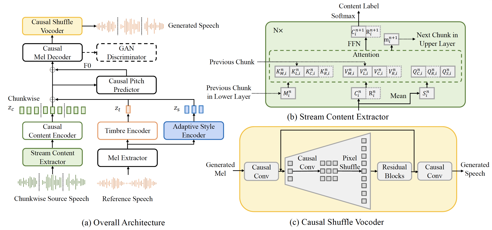
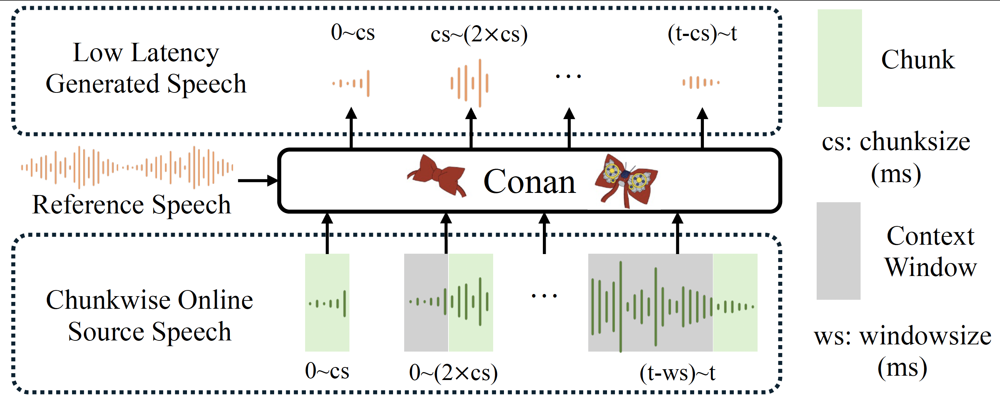

# Conan: A Chunkwise Online Network for Zero-Shot Adaptive Voice Conversion

[](https://www.python.org/downloads/release/python-310/)
[](https://pytorch.org/)
[](LICENSE)

This is the official implementation of our ASRU 2025 paper "**Conan: A Chunkwise Online Network for Zero-Shot Adaptive Voice Conversion**".

> **Current repository note (2026-04-01)**  
> This branch now contains a cleaner **Rhythm V2 / Minimal Strong-Rhythm** path for streaming rhythm transfer.
>
> Core idea:
>
> - keep Conan's streaming content frontend and decoder/vocoder path
> - remove rhythm control from the large style path
> - use an explicit `RefRhythmDescriptor`
> - use a single `MonotonicRhythmScheduler`
> - keep `StreamingRhythmProjector` as the only hard timing authority
> - treat scheduler tensors as internal planning surfaces, and treat projector execution as the maintained binding contract
> - inject a cheap internal `source_boundary_cue` instead of restoring boundary hints as public inputs
>
> Main files:
>
> - `modules/Conan/rhythm/reference_descriptor.py`
> - `modules/Conan/rhythm/scheduler.py`
> - `modules/Conan/rhythm/projector.py`
> - `modules/Conan/rhythm/module.py`
> - `tasks/Conan/rhythm/`
> - `docs/rhythm_module_vision.md`
> - `docs/rhythm_local_adaptation.md`
> - `docs/rhythm_migration_plan.md`
> - `docs/rhythm_training_stages.md`
> - `docs/rhythm_supervision_policy.md`
>
> Current status:
>
> - explicit reference rhythm stats/trace is connected
> - the maintained descriptor is an explicit baseline descriptor, not a final expressive prosody encoder
> - projector already freezes committed prefix, lifts planner budgets into a prefix-feasible region, and uses sparser pause allocation
> - trace sampling uses a fixed progress horizon with anchor-progress phase updates
> - scheduler now consumes a cheap source-boundary sidecar derived from `sep_hint + source duration shape`, but this sidecar is kept as a soft prior instead of a public control head
> - the unit frontend now exports `sealed_mask + boundary_confidence` and includes a stateful run-length unitizer helper
> - explicit blank-slot scheduling is now public: projector / renderer / loss all use the same interleaved blank-slot graph
> - renderer now also exports frame-level blank masks plus slot/unit indices for debugging and retimed training hooks
> - the renderer is still deterministic/hard-expanded, but it now carries minimal phase features so long stretched slots are not rendered as pure flat repeats
> - reference cache can also carry slow-rhythm memory cells, selector spans, and source-side phrase-group metadata, but these are treated as sidecars instead of the maintained runtime-minimal contract
> - dataset / loss path already reserves guidance and distillation fields
> - dataset can now prefer offline cached rhythm targets instead of always regenerating runtime heuristics
> - cached teacher surfaces now also carry allocation + prefix carry targets
> - runtime/batch targets now prefer `rhythm_pause_*`; `rhythm_blank_*` remains a cache/internal compatibility alias
> - an optional `rhythm_plan` proxy remains available for ablations, but the mainline now keeps it disabled by default
> - dual-mode teacher/student is now wired with a learned non-causal offline planner teacher plus the older algorithmic bootstrap targets
> - formal schedule-only warm-start now defaults to cached-only + cached teacher surfaces
> - stage-2 dual-mode KD config now has its own entry (`egs/conan_emformer_rhythm_v2_dual_mode_kd.yaml`)
> - streaming metrics now track carry / backlog / blank-slot usage in addition to no-rollback deltas
> - `scripts/smoke_test_rhythm_v2.py` now covers descriptor + stateful scheduler reuse
>
> Still missing before claiming a full strong-rhythm training closure:
>
> - stronger proof that the learned offline teacher improves real training runs beyond the current bootstrap level
> - stronger proof that the new `retimed_train` stage closes train/infer mismatch robustly on real runs
> - stronger joint closure between retimed render, retimed acoustic targets, and pitch supervision on real runs
> - stronger rhythm evaluation focused on pause placement / local-rate transfer / no-rollback stability
>
> Current staging note:
>
> - the default main config still keeps train/valid decoder reconstruction on the source-aligned canvas
> - test/inference already uses the retimed rhythm execution path
> - train-time retimed rendering should only be enabled after retimed acoustic targets are prepared
> - the binarizer can now cache a first-pass `rhythm_retimed_mel_tgt` built from cached rhythm targets
> - `egs/conan_emformer_rhythm_v2.yaml` now defaults to `rhythm_minimal_style_only: true`, i.e. keep global timbre embedding but disable the heavier local style/prosody adaptor path entirely
> - the rhythm route also overrides `mel_losses: "l1:1.0"` and now treats the mainline objective as executed speech/pause supervision + light budget + cumulative-plan guardrail + light `L_base`
> - when train/valid switch to the retimed canvas, source-aligned pitch supervision is automatically disabled unless retimed pitch targets are introduced later
> - staged rollout knobs now exist for future train-time retimed experiments:
>   - `rhythm_train_render_start_steps`
>   - `rhythm_valid_render_start_steps`
>   - `rhythm_retimed_target_start_steps`
>
> Practical supervision policy:
>
> - runtime heuristic targets are now a debug / fallback path, not the desired formal training path
> - `egs/conan_emformer_rhythm_v2.yaml` stays transitional with `rhythm_dataset_target_mode: prefer_cache`
> - `egs/conan_emformer_rhythm_v2_minimal_v1.yaml` is the maintained formal base config
> - `egs/conan_emformer_rhythm_v2_cached_only.yaml` is kept as a legacy alias to that base
> - `egs/conan_emformer_rhythm_v2_schedule_only.yaml` is now the formal cached-only stage-1 schedule config
> - `egs/conan_emformer_rhythm_v2_dual_mode_kd.yaml` is the formal stage-2 schedule distillation config
> - `egs/conan_emformer_rhythm_v2_retimed_train.yaml` is the stricter cached-only retimed-train config
> - cached-only experiments now validate a stricter rhythm cache contract (`rhythm_cache_version: 4`)
> - current cached targets are self-conditioned surfaces, so cache-based rhythm conditioning defaults to `rhythm_cached_reference_policy: self`
>
> Current streaming mode note:
>
> - the current repository still uses static full-reference rhythm conditioning (`static_ref_full`)
> - progressive streaming reference updates are future work, not the current default path
>
> Current task focus:
>
> - projector-centric timing supervision
> - projector-space public contract (`speech_exec`, `pause_exec`, `commit_frontier`, `next_state`)
> - cached-only reproducibility
> - dual-mode teacher/student schedule distillation
> - schedule-only warm-start support (`egs/conan_emformer_rhythm_v2_schedule_only.yaml`)
> - retimed train/infer closure
> - stronger streaming regression

<p align="center">
  <a href="https://arxiv.org/abs/2507.14534"><b>📄 Read the Paper (arXiv)</b></a> &nbsp;|&nbsp;
  <a href="https://aaronz345.github.io/ConanDemo/"><b>🎧 Demo Page</b></a>
</p>

<p align="center">
  
</p>

Zero-shot online voice conversion (VC) holds significant promise for real-time communications and entertainment. 
However, current VC models struggle to preserve semantic fidelity under real-time constraints, deliver natural-sounding conversions, and adapt effectively to unseen speaker characteristics.
To address these challenges, we introduce Conan, a chunkwise online zero-shot voice conversion model that preserves the content of the source while matching the speaker representation of reference speech.
Conan comprises three core components: 
1) A Stream Content Extractor that leverages Emformer for low-latency streaming content encoding; 
2) An Adaptive Style Encoder that extracts fine-grained stylistic features from reference speech for enhanced style adaptation; 
3) A Causal Shuffle Vocoder that implements a fully causal HiFiGAN using a pixel-shuffle mechanism. 
Experimental evaluations demonstrate that Conan outperforms baseline models in subjective and objective metrics.

## 🌟 Features

- **Streaming Voice Conversion**: Real-time voice conversion with low latency (~80ms)
- **Emformer Integration**: Efficient transformer-based content encoding
- **High-Quality Vocoding**: Pixel-shuffle  causal HiFi-GAN vocoder for natural-sounding audio output

## Workflow
Our workflow (inference procedure) is shown in the following figure.

we first feed the entire reference speech into the model to provide timbre
and stylistic information. During chunkwise online inference,
we wait until the input reaches a predefined chunk size before
passing it to the model. Because our generation speed for each
chunk is faster than the chunk’s duration, online generation
becomes possible. To ensure temporal continuity, we employ
a sliding context window strategy. At each generation step,
we not only input the source speech of the current chunk but
also include the preceding context. From the model’s output,
we extract only the segment for this chunk. As the context
covers the receptive field, consistent overlapping segments can
be generated, ensuring smooth transitions at chunk boundaries.

For the newer Rhythm V2 path, keep that paragraph as the **original Conan**
streaming assumption. The rhythm branch is stricter:

- reference still enters once as a cached conditioning source
- source still arrives chunkwise
- but timing is no longer owned by the decoder chunk crop
- timing is owned by `descriptor -> scheduler -> projector -> blank-slot renderer`

That means strong rhythm transfer should be evaluated on the explicit rendered
schedule, not on the older “source-aligned chunk slice” assumption alone.

## 📋 Requirements

### System Requirements
- Python 3.10+

## 🚀 Installation

1. **Clone the repository**:
```bash
git clone https://github.com/tanyrbs/conan-rhythm.git
cd conan-rhythm
```

2. **Create a virtual environment**:
```bash
conda create -n conan python=3.10
conda activate conan
```

3. **Install dependencies**:
```bash
pip install -r requirements.txt
```
## 📊 Data Preparation

### Dataset Structure
For the current Conan / Rhythm V2 path, `metadata.json` alone is **not** enough.

At minimum, prepare:

- `metadata_vctk_librittsr_gt.json` for the current VC binarizer path
- `spker_set.json`
- raw wav paths referenced by metadata
- HuBERT token sequences in metadata entries
- RMVPE F0 files for main-model training

If rhythm cache generation is enabled, the binarizer can additionally cache:

- source unit cache: `content_units`, `dur_anchor_src`, `open_run_mask`, `sealed_mask`, `boundary_confidence`
- source phrase cache: `source_boundary_cue`, `phrase_group_index`, `phrase_group_pos`, `phrase_final_mask`
- reference rhythm cache: `ref_rhythm_stats`, `ref_rhythm_trace`, `slow_rhythm_memory`, `slow_rhythm_summary`
- selector metadata: `selector_meta_indices`, `selector_meta_scores`, `selector_meta_starts`, `selector_meta_ends`
- cached guidance / teacher targets, including teacher allocation / prefix carry surfaces
- cached retimed mel targets

Keep the cache / batch schema layered:

- runtime-minimal contract: `content_units`, `dur_anchor_src`, `ref_rhythm_stats`, `ref_rhythm_trace`
- debug sidecars: source phrase cues, offline prefix views, selector spans, streaming prefix stats
- cache/audit bundle: cache version, hop/trace contract, confidence, retimed source metadata

Example:
```text
data/
`-- processed/
    |-- metadata_vctk_librittsr_gt.json
    `-- spker_set.json
```
### Metadata Format
There is an example "example_metadata.json" file in the `data/processed/vc/` directory.
The metadata file should contain entries like:
```json
[
  {
    "item_name": "speaker1_audio1",
    "wav_fn": "data/raw/speaker1/audio1.wav", // Path to the raw audio file
    "spk_embed": "0.1 0.2 0.3 ...", // Speaker embedding vector
    "duration": 3.5, // Duration in seconds
    "hubert": "12 34 56 ..." // HuBERT features as space-separated string
  }
]
```

### Data Preprocessing Steps

1. **Extract F0 features using RMVPE (needed only for main model training)**:
```bash
export PYTHONPATH=/storage/baotong/workspace/Conan:$PYTHONPATH # (optional) you may need to set the PYTHONPATH for import dependencies
python trials/extract_f0_rmvpe.py \
    --config egs/conan_emformer_rhythm_v2_cached_only.yaml \
    --batch-size 80 \
    --save-dir /path/to/audio  
```
F0 will be saved to the same level folder as the audio folder.
File structure: (an example below)
```data/
└── audio/
    ├── p225_001.wav
    ├── ...
└── audio_f0/
    ├── p225_001.npy
    ├── ...
```
2. **Binarize the dataset**:
```bash
python data_gen/tts/runs/binarize.py --config egs/conan_emformer_rhythm_v2_cached_only.yaml
```

For formal Rhythm V2 experiments:

- use the cached-only config for binarization
- prefer the maintained `minimal_v1` base when starting a new formal training chain
- keep `rhythm_binarize_teacher_targets: true`
- re-binarize whenever `rhythm_cache_version` changes
- treat `prefer_cache` only as a migration/debug mode

For formal Rhythm V2 experiments, binarization should be re-run with rhythm cache enabled so training can use offline cached targets instead of runtime heuristics.
### Configuration
Update the configuration files in `egs/` directory to match your dataset:
- `egs/conan_emformer_rhythm_v2.yaml`: transitional rhythm config (`prefer_cache`)
- `egs/conan_emformer_rhythm_v2_minimal_v1.yaml`: maintained formal base config
- `egs/conan_emformer_rhythm_v2_cached_only.yaml`: legacy alias to the maintained formal base
- `egs/conan_emformer_rhythm_v2_schedule_only.yaml`: formal stage-1 schedule warm-start
- `egs/conan_emformer_rhythm_v2_dual_mode_kd.yaml`: formal stage-2 dual-mode schedule KD
- `egs/conan_emformer_rhythm_v2_retimed_train.yaml`: retimed acoustic training stage
- `egs/conan_emformer.yaml`: legacy / baseline main training configuration
- `egs/emformer.yaml`: Emformer training configuration
- `egs/hifi_16k320_shuffle.yaml`: Vocoder training configuration

Key parameters to adjust:
```yaml
# Dataset paths
binary_data_dir: 'data/binary/vc'
processed_data_dir: 'data/processed/vc'
```
## 🎯 Training

### Stage 1: Train Emformer
We first prepare the data and HuBERT tokens from the s3prl package using ```s3prl.nn.S3PRLUpstream("hubert")```.
```bash
CUDA_VISIBLE_DEVICES=0 python tasks/run.py \
    --config egs/emformer.yaml \
    --exp_name emformer_training \
    --reset
```

### Stage 2: Train Main Conan Model
We fix the Emformer and Vocoder components, and prepare hubert entries of the data by applying the trained Emformer through the datasets (extracted chunk-wise).
```bash
CUDA_VISIBLE_DEVICES=0 python tasks/run.py \
    --config egs/conan_emformer.yaml \
    --exp_name conan_training \
    --reset
```

### Stage 3: Train HiFi-GAN Vocoder
```bash
CUDA_VISIBLE_DEVICES=0 python tasks/run.py \
    --config egs/hifi_16k320_shuffle.yaml \
    --exp_name hifigan_training \
    --reset
```

### Rhythm V2 warm-start / retimed training

Before starting any formal Rhythm V2 run, do a cache/config preflight:
```bash
python scripts/preflight_rhythm_v2.py \
    --config egs/conan_emformer_rhythm_v2_schedule_only.yaml \
    --binary_data_dir data/binary/your_dataset \
    --model_dry_run
```

Formal expectation:

- `train` and `valid` must both pass raw cache inspection **and** survive `ConanDataset` filtering
- repeat preflight with the exact config for each stage
- the bundled smoke cache is only for structural sanity checks; if its `valid` split is intentionally filtered empty, use `--splits train` for smoke-only checks, but do not treat that as formal training readiness

Recommended formal path:

1. `schedule_only`
2. `dual_mode_kd`
3. `retimed_train`

Transitional warm-start:
```bash
CUDA_VISIBLE_DEVICES=0 python tasks/run.py \
    --config egs/conan_emformer_rhythm_v2.yaml \
    --exp_name conan_rhythm_v2 \
    --reset
```

Strict cached-only warm-start:
```bash
CUDA_VISIBLE_DEVICES=0 python tasks/run.py \
    --config egs/conan_emformer_rhythm_v2_cached_only.yaml \
    --exp_name conan_rhythm_v2_cached \
    --reset
```

Formal stage-1 schedule-only warm-start:
```bash
CUDA_VISIBLE_DEVICES=0 python tasks/run.py \
    --config egs/conan_emformer_rhythm_v2_schedule_only.yaml \
    --exp_name conan_rhythm_v2_sched \
    --reset
```

Formal stage-2 dual-mode schedule KD:
```bash
CUDA_VISIBLE_DEVICES=0 python tasks/run.py \
    --config egs/conan_emformer_rhythm_v2_dual_mode_kd.yaml \
    --exp_name conan_rhythm_v2_dual_kd \
    --reset
```

Strict cached-only retimed-train experiment:
```bash
CUDA_VISIBLE_DEVICES=0 python tasks/run.py \
    --config egs/conan_emformer_rhythm_v2_retimed_train.yaml \
    --exp_name conan_rhythm_v2_retimed \
    --reset
```

## 🔮 Inference

### Streaming Voice Conversion
```bash
CUDA_VISIBLE_DEVICES=0 python inference/Conan.py \
    --config egs/conan_emformer_rhythm_v2.yaml \
    --exp_name conan
```
Use the exp_name that contains the trained main model checkpoints, and update your config with the trained Emformer checkpoint and HifiGAN checkpoint.

## Checkpoints
You can download pre-trained model checkpoints from [Google Drive](https://drive.google.com/drive/folders/1QhnECo2L4xfXDgdrnM6L1xpsH7u3iRvj?usp=sharing).

Main system checkpoint folders: Emformer, Conan, hifigan_vc

Fast system checkpoint folders: Emformer_fast, Conan_fast, hifigan_vc (you may need to change the "right_context" in the config file to 0 instead of 2)

Note: As we previous developed the Emformer training branch on another codebase, we provided another inference script for it `inference/Conan_previous.py`.
## 📁 Project Structure

```
Conan/
├── modules/                    # Core model implementations
│   ├── Conan/                 # Main Conan model
│   ├── Emformer/              # Emformer feature extractor
│   ├── vocoder/               # HiFi-GAN vocoder
│   └── ...
├── tasks/                     # Training and evaluation tasks
│   ├── Conan/                 # Conan training task
│   └── ...
├── inference/                 # Inference scripts
│   ├── Conan.py              # Main inference script
│   ├── run_voice_conversion.py
│   └── ...
├── data_gen/                  # Data preprocessing
│   ├── conan_binarizer.py    # Data binarization
│   └── ...
├── egs/                       # Configuration files
│   ├── conan_emformer_rhythm_v2.yaml
│   ├── conan_emformer_rhythm_v2_cached_only.yaml
│   ├── conan_emformer_rhythm_v2_schedule_only.yaml
│   ├── conan_emformer_rhythm_v2_dual_mode_kd.yaml
│   ├── emformer.yaml         # Emformer config
│   └── ...
├── utils/                     # Utility functions
└── checkpoints/              # Model checkpoints
```
## 📈 Performance

The Conan system achieves state-of-the-art performance on voice conversion tasks:

- **Latency**: ~80ms streaming latency (37ms latency for fast system)
- **Quality**: High-quality voice conversion with natural prosody
- **Robustness**: Robust to different speaking styles and content

## 📄 Citation

If you use Conan in your research, please cite our work:

```bibtex
@article{zhang2025conan,
  title={Conan: A Chunkwise Online Network for Zero-Shot Adaptive Voice Conversion},
  author={Zhang, Yu and Tian, Baotong and Duan, Zhiyao},
  journal={arXiv preprint arXiv:2507.14534},
  year={2025}
}
```

## 📜 License

This project is licensed under the MIT License - see the [LICENSE](LICENSE) file for details.

## 🙏 Acknowledgements

- [FastSpeech2](https://github.com/ming024/FastSpeech2) for the codebase and base TTS architectures
- [HiFi-GAN](https://github.com/jik876/hifi-gan) for the neural vocoder
- [Emformer](https://github.com/pytorch/audio) for efficient transformer implementation
